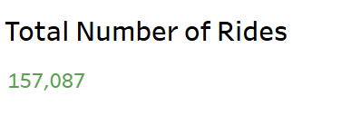
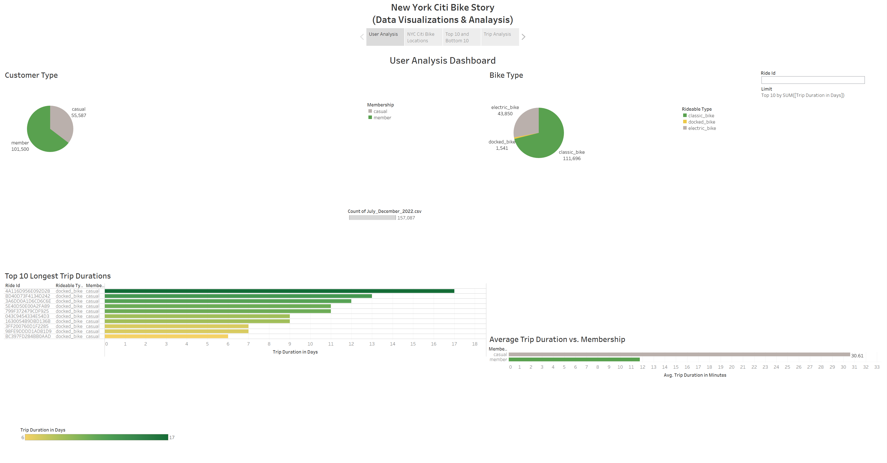
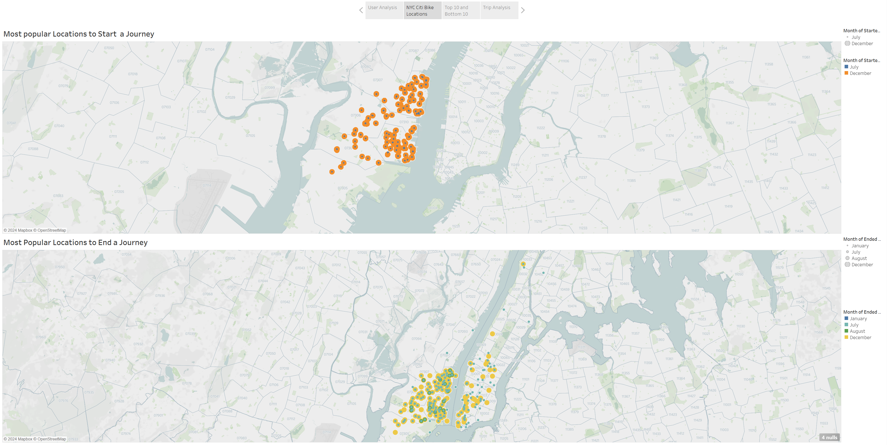
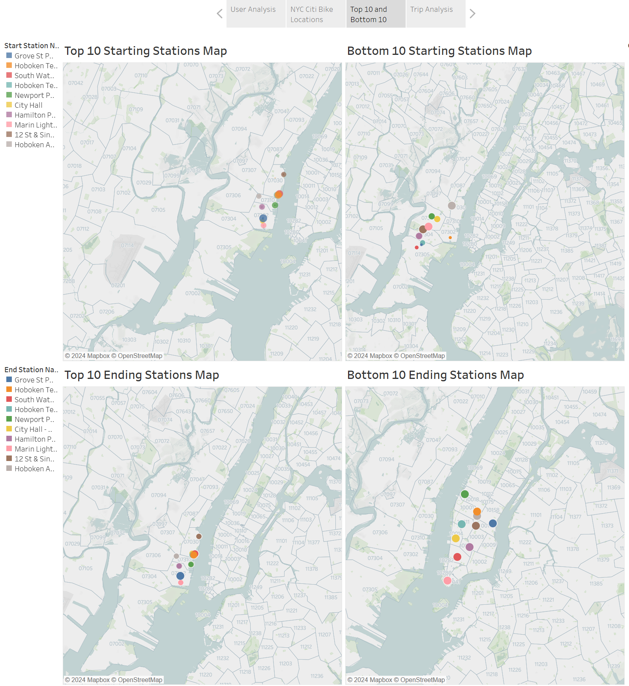
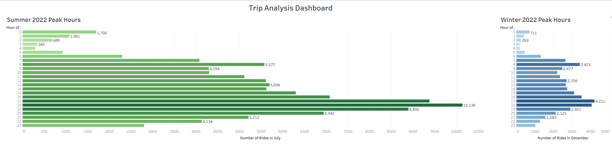
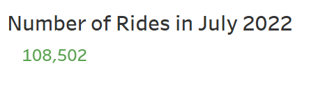
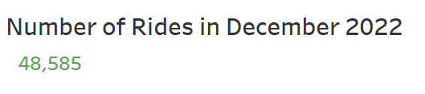
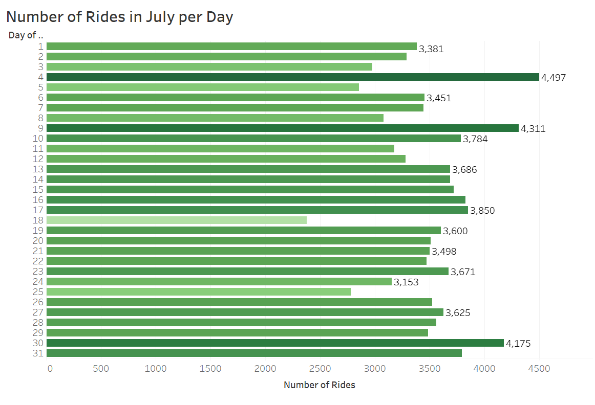
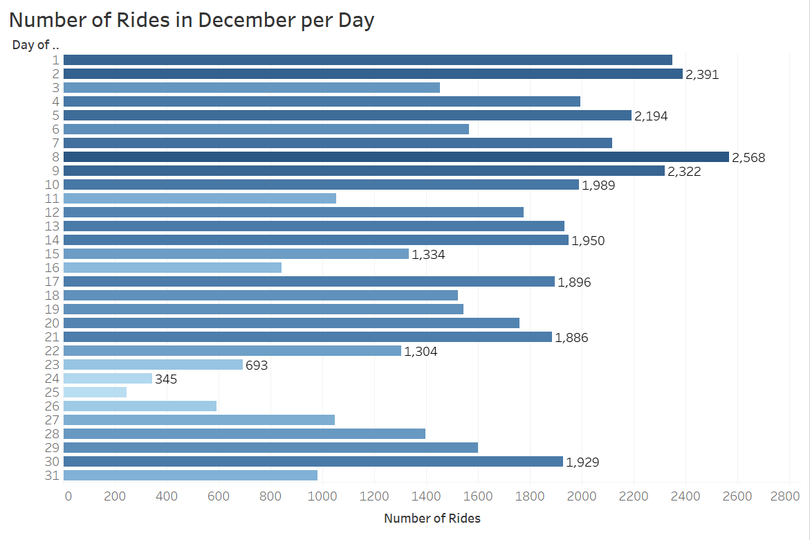

# New_York_Citi_Bike_Data_Visulaizations
 New York CitiBikes is an open-source project where interactive visualizations and maps will be implemented to show insights from the citibike data. Here the meaningful insights from the data revealed using Tableau public. 

### New York Citi Bike Data Visulaizations

Hi, let's extract trends with data visualizations with an interactive Tableau visuals, dashboards and strories.

### 1 Introduction 

The New York Citi Bike Data reveals meaningful visuals that helps the business to understand the riders trends, trips durations and popularity of prefered locations to make more strategic decisions with acknowledgement of some research  answers.

### 2 Data Sources

We used the data from [CitiBike Program](https://citibikenyc.com/system-data)

### 3 Features

Used a map to show the locations of Citi Bike stations. Color-code the stations based on metrics like usage frequency or bike availability.

Created line charts or area charts to visualize the usage patterns over time that includes daily, weekly, or monthly trends.

Include visualizations that represent subscribers vs. customers.

Created visualizations that showcase popular bike routes or travel patterns. 

Integrate key performance indicators (KPIs) that summarize the overall system performance. This might include metrics like total rides, average ride duration, or system efficiency.

Explore the possibility of incorporating predictive analytics, such as forecasting future bike usage based on historical data.

We created interactive dashboards is interactive, allowing users to filter and explore the data dynamically.

Use Tableau's storytelling features to guide users through a narrative. 

### 4 Data Discoveries & Dashboards

At a glance, there is the sotry on which all the four dashboards are created. Each important visuals are covered in the dashbaords.

#### 4.1 User Analysis  Dashboard

The total numbers of rides shows for which the user dashboard depicts the trends for us.

From the above user analysis dashboard, the over half of the total customer base is represented by annual memberships.

While electric bikes number less than 50,000, the classic bikes surpass one million. Interestingly, the count of docked bikes is remarkably low, approximately 1,500, nevertheless, these bikes are secured.

The overall trip duration ranges from 6 to 17 days. Remarkably, the ten longest trips are attributed to casual members, and all these journeys utilized docked bikes.

The average trip duration for annual customers is 11 minutes, whereas casual members have an average trip duration of 30 minutes.

#### 4.2 Most Popular Locations Dashboard

Here, we can see demographically the location fro starting and ending the trips are almost in the same region as shown on the location pin points.

#### 4.3 Top 10 & Bottom 10 Dashboard

Considering the total popular locations, the top 10 and bottom 10 locations are sounds in the same circle in the map.

The "Grove ST Path" station is on the top of starting 6,196 trips and ending 7,578 trips.

#### 4.4 Trip Analysis Dashboard

During the summer, the trip count significantly increases, reaching a maximum of 10,139, while in winter, the maximum number of trips is less than half of this value.

Peak trip hours occur during both winter and summer, spanning from 4:00 pm to 7:00 pm.

### 5 Additional Key Trends 

The number of rides are double in July 2022 than of December. Weather impacts half of the number of ride to execute.

The above comparison of July and December Number of Rides shows a prominent differenc eof range in numbers for each  day.

### 6 Deployment

This story of New York CitiBike dashboards is deployed on [Tableau Public Visualization](https://public.tableau.com/views/NewYorkCitiBikeDataVisualizationsAnalysis/UserAnalysisDashboard?:language=en-US&:display_count=n&:origin=viz_share_link)

## Author

## [Jalees Moeen GitHub](https://github.com/JaleesMoeen)

